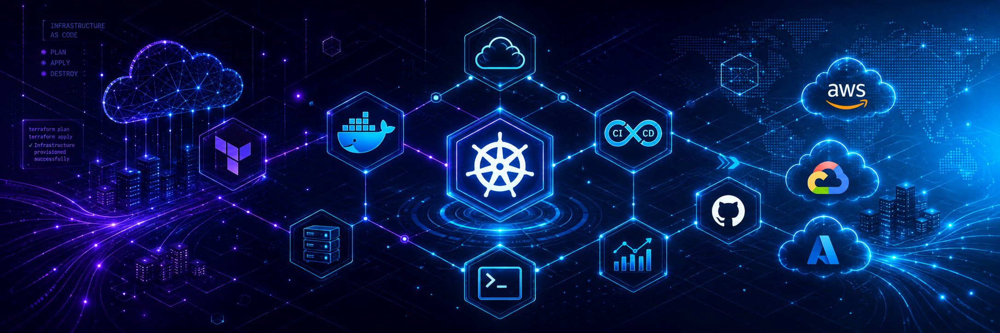
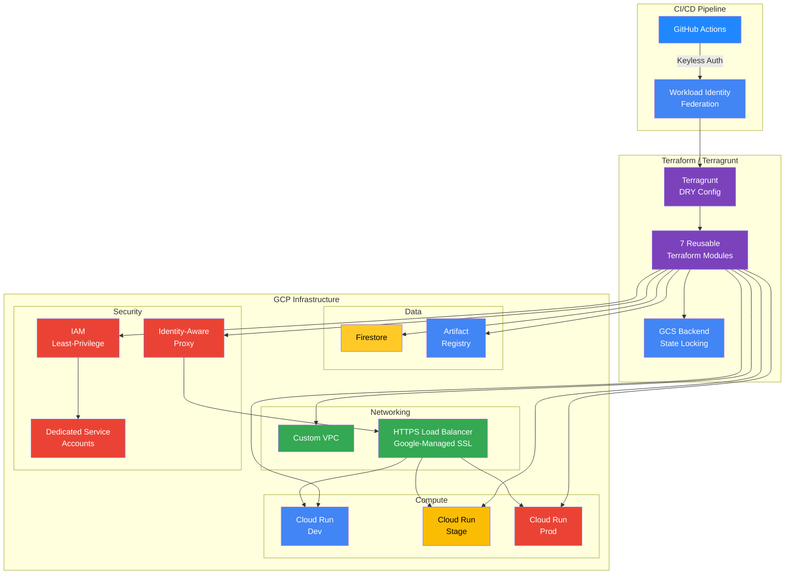
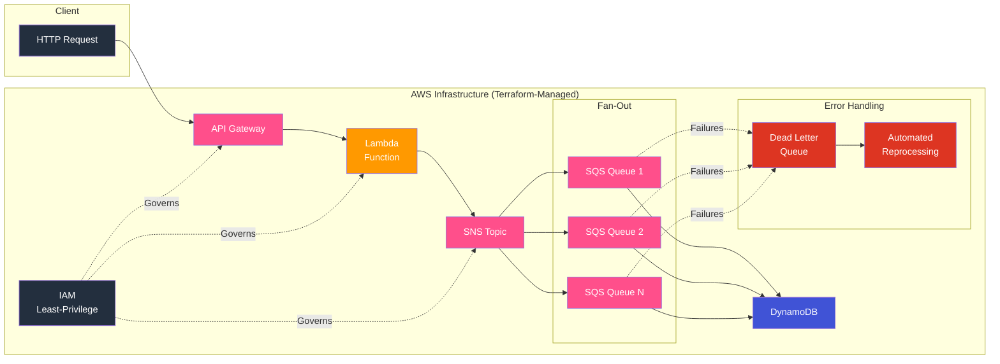
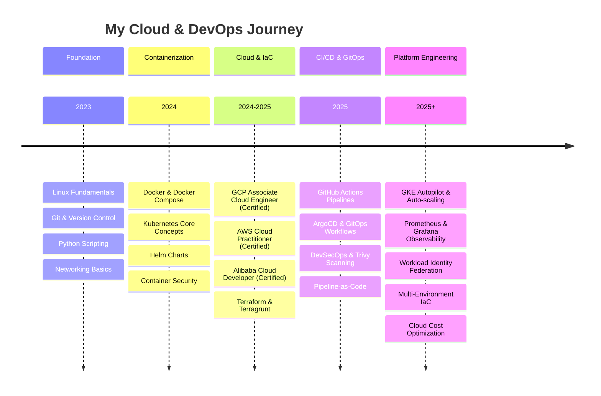

```mermaid
graph LR
    subgraph "Developer"
        DEV["Git Push"]
    end

    subgraph "CI — GitHub Actions"
        BUILD["Docker Build"]
        SCAN["Trivy Scan"]
        PUSH["Push to\nArtifact Registry"]
        UPDATE["Update K8s\nManifests"]
    end

    subgraph "CD — ArgoCD"
        ARGO["ArgoCD\nReconciliation"]
        SYNC["Auto-Sync"]
    end

    subgraph "GKE Autopilot"
        subgraph "Workloads"
            DEV_NS["Dev Namespace"]
            STG_NS["Staging Namespace"]
        end
        subgraph "Observability"
            PROM["Prometheus"]
            GRAF["Grafana\nDashboards"]
            ALERT["Alert Rules"]
        end
    end

    DEV --> BUILD
    BUILD --> SCAN
    SCAN -->|"Block HIGH/CRITICAL"| PUSH
    PUSH --> UPDATE
    UPDATE --> ARGO
    ARGO --> SYNC
    SYNC --> DEV_NS & STG_NS
    DEV_NS & STG_NS --> PROM
    PROM --> GRAF
    PROM --> ALERT

    style DEV fill:#181717,color:#fff
    style BUILD fill:#2496ED,color:#fff
    style SCAN fill:#1904DA,color:#fff
    style PUSH fill:#4285F4,color:#fff
    style UPDATE fill:#2088FF,color:#fff
    style ARGO fill:#EF7B4D,color:#fff
    style SYNC fill:#EF7B4D,color:#fff
    style DEV_NS fill:#326CE5,color:#fff
    style STG_NS fill:#326CE5,color:#fff
    style PROM fill:#E6522C,color:#fff
    style GRAF fill:#F46800,color:#fff
    style ALERT fill:#E6522C,color:#fff
```

```mermaid
graph LR
    A["Linux"] --> B["Git"]
    B --> C["Docker"]
    C --> D["Kubernetes"]
    D --> E["Terraform"]
    E --> F["GCP"]
    F --> G["AWS"]
    G --> H["GitHub Actions"]
    H --> I["ArgoCD & GitOps"]
    I --> J["Monitoring\nPrometheus + Grafana"]
    J --> K["DevSecOps\nTrivy + IAM"]
    K --> L["Platform\nEngineering"]

    style A fill:#FCC624,color:#000
    style B fill:#F05032,color:#fff
    style C fill:#2496ED,color:#fff
    style D fill:#326CE5,color:#fff
    style E fill:#7B42BC,color:#fff
    style F fill:#4285F4,color:#fff
    style G fill:#FF9900,color:#fff
    style H fill:#2088FF,color:#fff
    style I fill:#EF7B4D,color:#fff
    style J fill:#E6522C,color:#fff
    style K fill:#1904DA,color:#fff
    style L fill:#00D4FF,color:#000
```

<!-- ══════════════════════════════════════════════════════════════════════════════ -->
<!-- VANSHIT SHARMA — GITHUB PROFILE README                                      -->
<!-- Cloud & DevOps Engineer | GCP · AWS · Azure | Terraform · Kubernetes · GitOps -->
<!-- ══════════════════════════════════════════════════════════════════════════════ -->

<!-- BANNER -->
<div align="center">
  
</div>

<br/>

<!-- ─── HERO SECTION ─────────────────────────────────────────────────────────── -->
<div align="center">

  <!-- Animated Name -->
  

  <br/>

  <!-- Animated Role -->
  

  <br/>

  <!-- Badges Row -->
  <a href="https://linkedin.com/in/vanshit-sharma"></a>&nbsp;
  <a href="https://github.com/vanshitsharma18"></a>&nbsp;
  <a href="mailto:vanshitsharma2006@gmail.com"></a>&nbsp;
  

  <br/><br/>

  <!-- Visitor Counter -->
  

</div>

<!-- Divider -->


<!-- ─── ABOUT ME ─────────────────────────────────────────────────────────────── -->

##  &nbsp;About Me

<table>
<tr>
<td width="60%">

GCP-Certified DevOps and Cloud Engineer specializing in **Infrastructure-as-Code**, **Kubernetes orchestration**, and **CI/CD pipeline automation**.

I architect multi-environment cloud infrastructure using **Terraform** and **Terragrunt**, build **GitOps** delivery pipelines with **ArgoCD** and **GitHub Actions**, and implement **DevSecOps** practices with container security scanning — all while maintaining production-grade observability across distributed systems.

**What drives me:**

- Automating everything that can be automated
- Designing infrastructure that's reproducible, auditable, and secure
- Reducing deployment friction from hours to minutes
- Building platforms that empower development teams
- Continuous learning across multi-cloud ecosystems

</td>
<td width="40%" align="center">

```yaml
apiVersion: engineer/v1
kind: CloudDevOpsEngineer
metadata:
  name: vanshit-sharma
  location: New Delhi, India
spec:
  education: B.Tech CSE (2023-2027)
  certifications:
    - GCP Associate Cloud Engineer
    - AWS Cloud Practitioner
    - Alibaba Cloud Developer
  focus:
    - Infrastructure as Code
    - Kubernetes & GitOps
    - CI/CD Automation
    - Cloud Security
  philosophy: "Automate. Observe. Iterate."
```

</td>
</tr>
</table>

<!-- Divider -->


<!-- ─── TECH STACK ───────────────────────────────────────────────────────────── -->

##  &nbsp;Tech Stack

<details open>
<summary><b>Cloud Platforms</b></summary>
<br/>
<p>
  
  
  
  
  
  
  
  
  
  
  
</p>
</details>

<details open>
<summary><b>Containers & Orchestration</b></summary>
<br/>
<p>
  
  
  
  
  
  
</p>
</details>

<details open>
<summary><b>Infrastructure as Code</b></summary>
<br/>
<p>
  
  
  
  
</p>
</details>

<details open>
<summary><b>CI/CD & GitOps</b></summary>
<br/>
<p>
  
  
  
  
</p>
</details>

<details open>
<summary><b>Monitoring & Security</b></summary>
<br/>
<p>
  
  
  
  
  
  
</p>
</details>

<details open>
<summary><b>Programming & Scripting</b></summary>
<br/>
<p>
  
  
  
</p>
</details>

<details open>
<summary><b>Operating Systems</b></summary>
<br/>
<p>
  
  
</p>
</details>

<details open>
<summary><b>Version Control</b></summary>
<br/>
<p>
  
  
</p>
</details>

<details open>
<summary><b>Databases</b></summary>
<br/>
<p>
  
  
</p>
</details>

<!-- Divider -->


<!-- ─── SKILLS DASHBOARD ─────────────────────────────────────────────────────── -->

##  &nbsp;Skills Dashboard

<table>
<tr>
<th>Domain</th>
<th>Technology</th>
<th>Proficiency</th>
</tr>

<!-- Cloud Platforms -->
<tr><td rowspan="2"><b>Cloud Platforms</b></td>
<td>Google Cloud Platform (GCP)</td><td><code>█████████░</code> <b>Advanced</b></td></tr>
<tr><td>Amazon Web Services (AWS)</td><td><code>████████░░</code> <b>Advanced</b></td></tr>

<!-- IaC -->
<tr><td rowspan="2"><b>Infrastructure as Code</b></td>
<td>Terraform</td><td><code>█████████░</code> <b>Advanced</b></td></tr>
<tr><td>Terragrunt</td><td><code>████████░░</code> <b>Advanced</b></td></tr>

<!-- Containers -->
<tr><td rowspan="4"><b>Containers & Orchestration</b></td>
<td>Docker</td><td><code>█████████░</code> <b>Advanced</b></td></tr>
<tr><td>Kubernetes</td><td><code>████████░░</code> <b>Advanced</b></td></tr>
<tr><td>Helm</td><td><code>████████░░</code> <b>Advanced</b></td></tr>
<tr><td>ArgoCD</td><td><code>████████░░</code> <b>Advanced</b></td></tr>

<!-- CI/CD -->
<tr><td rowspan="2"><b>CI/CD & GitOps</b></td>
<td>GitHub Actions</td><td><code>█████████░</code> <b>Advanced</b></td></tr>
<tr><td>GitOps Workflows</td><td><code>████████░░</code> <b>Advanced</b></td></tr>

<!-- Monitoring -->
<tr><td rowspan="3"><b>Monitoring & Observability</b></td>
<td>Prometheus</td><td><code>████████░░</code> <b>Advanced</b></td></tr>
<tr><td>Grafana</td><td><code>████████░░</code> <b>Advanced</b></td></tr>
<tr><td>Google Cloud Monitoring</td><td><code>████████░░</code> <b>Advanced</b></td></tr>

<!-- Security -->
<tr><td rowspan="3"><b>Cloud Security</b></td>
<td>IAM Least-Privilege</td><td><code>█████████░</code> <b>Advanced</b></td></tr>
<tr><td>Trivy Container Scanning</td><td><code>████████░░</code> <b>Advanced</b></td></tr>
<tr><td>Workload Identity Federation</td><td><code>████████░░</code> <b>Advanced</b></td></tr>

<!-- Scripting -->
<tr><td rowspan="2"><b>Scripting</b></td>
<td>Python</td><td><code>████████░░</code> <b>Advanced</b></td></tr>
<tr><td>Bash / Shell</td><td><code>████████░░</code> <b>Advanced</b></td></tr>

</table>

<!-- Divider -->


<!-- ─── CERTIFICATIONS ───────────────────────────────────────────────────────── -->

##  &nbsp;Certifications

<div align="center">

<table>
<tr>
<td align="center" width="33%">
<br/>

<br/><br/>
<b>Associate Cloud Engineer</b>
<br/>
<sub>Google Cloud Platform</sub>
<br/><br/>
</td>
<td align="center" width="33%">
<br/>

<br/><br/>
<b>Cloud Practitioner</b>
<br/>
<sub>Amazon Web Services (CLF-C02)</sub>
<br/><br/>
</td>
<td align="center" width="33%">
<br/>

<br/><br/>
<b>Certified Developer</b>
<br/>
<sub>Alibaba Cloud</sub>
<br/><br/>
</td>
</tr>
</table>

</div>

<!-- Divider -->


<!-- ─── EXPERIENCE ───────────────────────────────────────────────────────────── -->

##  &nbsp;Experience

<table>
<tr>
<td>

### DevOps & Automation Intern — NextGenya Solutions, Noida
<sub>Jun 2025 – Jul 2025</sub>

- Integrated **Azure DevOps CI/CD pipelines** to automate ServiceNow change requests, approval workflows, and release governance — reducing manual release coordination by **30%** with zero unauthorized deployments
- Developed **REST APIs** to synchronize deployment and incident data across tools; automated IT operations using **ServiceNow Business Rules & Flow Designer** — improving incident response time by **~25%** and eliminating **~15%** of repetitive manual tasks

</td>
</tr>
</table>

<!-- Divider -->


<!-- ─── FEATURED PROJECTS ────────────────────────────────────────────────────── -->

##  &nbsp;Featured Projects

<!-- Project 1 -->
<details open>
<summary><h3>GCP Incident Management Platform — Multi-Environment IaC</h3></summary>

<table>
<tr>
<td>

**Enterprise-grade multi-environment GCP infrastructure provisioned entirely through Terraform and Terragrunt**

<br/>

| Attribute | Details |
|-----------|---------|
| **Architecture** | Multi-environment (dev/stage/prod) GCP infrastructure with 7 reusable Terraform modules |
| **Tech Stack** | `Terraform` `Terragrunt` `Cloud Run` `Firestore` `Artifact Registry` `IAP` `VPC` `WIF` `GitHub Actions` |
| **Key Features** | Workload Identity Federation for keyless CI/CD auth, IAP for OAuth 2.0 access control, HTTPS LB with Google-managed SSL, remote state in GCS with locking |
| **Impact** | Zero unauthorized access across environments, complete infrastructure auditability, single DRY codebase for all environments |
| **Learning** | Advanced Terraform module design, GCP security best practices, enterprise IaC patterns |

<br/>

<p>
  <a href="https://github.com/vanshitsharma18"></a>&nbsp;
  
</p>

</td>
</tr>
</table>

</details>

<!-- Project 2 -->
<details open>
<summary><h3>GitOps Kubernetes Deployment Pipeline</h3></summary>

<table>
<tr>
<td>

**End-to-end GitOps platform on GKE Autopilot with ArgoCD, achieving 82% faster deployments**

<br/>

| Attribute | Details |
|-----------|---------|
| **Architecture** | GitOps pipeline: GitHub Actions (CI) → ArgoCD (CD) → GKE Autopilot with Prometheus/Grafana observability |
| **Tech Stack** | `GitHub Actions` `GKE Autopilot` `ArgoCD` `Kubernetes` `Helm` `Prometheus` `Grafana` `Trivy` `Docker` |
| **Key Features** | Declarative Git-based reconciliation, Trivy vulnerability scanning as CI gate, custom Grafana dashboards, auto-scaling |
| **Impact** | Deployment time: 45 min → 8 min (**82% reduction**), config drift: 4 incidents/sprint → 0, 100% pre-deployment security scanning, sub-200ms p95 latency |
| **Learning** | GitOps workflows, Kubernetes observability, container security in CI/CD |

<br/>

<p>
  <a href="https://github.com/vanshitsharma18"></a>&nbsp;
  
</p>

</td>
</tr>
</table>

</details>

<!-- Project 3 -->
<details open>
<summary><h3>Serverless Notification System (AWS)</h3></summary>

<table>
<tr>
<td>

**Event-driven serverless architecture on AWS handling 10,000 concurrent requests at &lt;200ms latency**

<br/>

| Attribute | Details |
|-----------|---------|
| **Architecture** | Event-driven fan-out: API Gateway → Lambda → SNS → SQS → DynamoDB with DLQ for failure reprocessing |
| **Tech Stack** | `Terraform` `AWS Lambda` `API Gateway` `SNS` `SQS` `DynamoDB` `IAM` |
| **Key Features** | One-command reproducible deployments, IAM least-privilege via Terraform, Dead Letter Queues for zero message loss, fully managed auto-scaling |
| **Impact** | ~70% infrastructure cost reduction vs. EC2-equivalent, 10K concurrent requests at <200ms, zero over-permissioned service accounts |
| **Publication** | Architecture published at **Com-IT CON 2025 International Conference** |

<br/>

<p>
  <a href="https://github.com/vanshitsharma18"></a>&nbsp;
  &nbsp;
  
</p>

</td>
</tr>
</table>

</details>

<!-- Divider -->


<!-- ─── CLOUD ARCHITECTURE DIAGRAMS ──────────────────────────────────────────── -->

##  &nbsp;Cloud Architecture

<details open>
<summary><b>GCP Incident Management Platform — Architecture</b></summary>
<br/>



</details>

<details>
<summary><b>GitOps Kubernetes Pipeline — Architecture</b></summary>
<br/>



</details>

<details>
<summary><b>AWS Serverless Notification System — Architecture</b></summary>
<br/>



</details>

<!-- Divider -->


<!-- ─── GITHUB ANALYTICS ─────────────────────────────────────────────────────── -->

##  &nbsp;GitHub Analytics

<div align="center">

<!-- Stats + Streak side by side -->
<p>
  
  &nbsp;
  
</p>

<!-- Top Languages -->
<p>
  
</p>

<!-- Activity Graph -->
<p>
  
</p>

<!-- Trophies -->
<p>
  
</p>

</div>

<!-- Divider -->


<!-- ─── DEVOPS ROADMAP ───────────────────────────────────────────────────────── -->

##  &nbsp;DevOps Roadmap



<!-- Divider -->


<!-- ─── CLOUD JOURNEY ────────────────────────────────────────────────────────── -->

##  &nbsp;Cloud Journey



<!-- Divider -->


<!-- ─── CURRENT FOCUS ────────────────────────────────────────────────────────── -->

##  &nbsp;Current Focus

<table>
<tr>
<td width="50%">

**Building & Shipping**
- Architecting enterprise multi-cloud infrastructure
- Building production-grade GitOps delivery platforms
- Implementing DevSecOps pipelines with automated security gates
- Designing event-driven serverless architectures

</td>
<td width="50%">

**Learning & Growing**
- Platform Engineering & Internal Developer Platforms
- Advanced Kubernetes patterns & service mesh
- Cloud Cost Optimization & FinOps
- Observability engineering & SRE practices
- Multi-cloud networking & security

</td>
</tr>
</table>

<!-- Divider -->


<!-- ─── RESEARCH & PUBLICATIONS ──────────────────────────────────────────────── -->

##  &nbsp;Research & Publications

<table>
<tr>
<td>

### Com-IT CON 2025 International Conference

**Serverless Notification System — AWS Architecture & Terraform Implementation**

Published research on designing and implementing an event-driven serverless notification system on AWS using Terraform Infrastructure-as-Code. The paper covers architecture decisions for a fan-out pattern using Lambda, API Gateway, SNS, SQS, and DynamoDB — achieving ~70% cost reduction compared to EC2-equivalent infrastructure while handling 10,000 concurrent requests at sub-200ms latency.

<br/>


</td>
</tr>
</table>

<!-- Divider -->


<!-- ─── ACHIEVEMENTS ─────────────────────────────────────────────────────────── -->

##  &nbsp;Achievements

<div align="center">

<table>
<tr>
<td align="center" width="25%">
<br/>

<br/><br/>
<b>Triple Cloud Certified</b>
<br/>
<sub>GCP + AWS + Alibaba Cloud</sub>
<br/><br/>
</td>
<td align="center" width="25%">
<br/>

<br/><br/>
<b>82% Deployment Reduction</b>
<br/>
<sub>45 min → 8 min via GitOps</sub>
<br/><br/>
</td>
<td align="center" width="25%">
<br/>

<br/><br/>
<b>~70% Cost Reduction</b>
<br/>
<sub>Serverless vs EC2-equivalent</sub>
<br/><br/>
</td>
<td align="center" width="25%">
<br/>

<br/><br/>
<b>Published Researcher</b>
<br/>
<sub>Com-IT CON 2025</sub>
<br/><br/>
</td>
</tr>
</table>

</div>

<!-- Divider -->


<!-- ─── CONNECT WITH ME ──────────────────────────────────────────────────────── -->

##  &nbsp;Connect With Me

<div align="center">

<a href="https://linkedin.com/in/vanshit-sharma">
  
</a>&nbsp;&nbsp;
<a href="https://github.com/vanshitsharma18">
  
</a>&nbsp;&nbsp;
<a href="mailto:vanshitsharma2006@gmail.com">
  
</a>

<br/><br/>

> *Open to opportunities in Cloud Engineering, DevOps, and Platform Engineering roles.*

</div>

<!-- Divider -->


<!-- ─── QUOTE ────────────────────────────────────────────────────────────────── -->

<div align="center">
<br/>

> *"The best infrastructure is the one nobody has to think about — it just works, scales, and heals itself."*

<br/>
</div>

<!-- ─── FOOTER ───────────────────────────────────────────────────────────────── -->

<div align="center">

  

</div>

<!-- ══════════════════════════════════════════════════════════════════════════════ -->
<!-- Built with precision. Deployed with confidence.                              -->
<!-- ══════════════════════════════════════════════════════════════════════════════ -->
